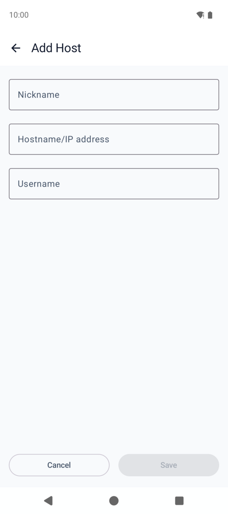
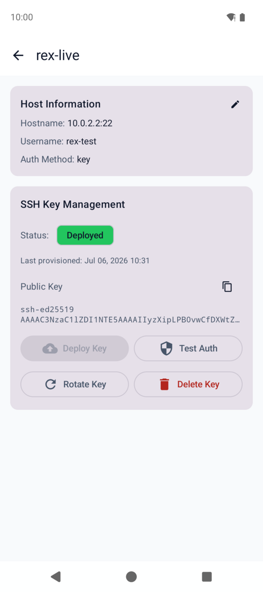
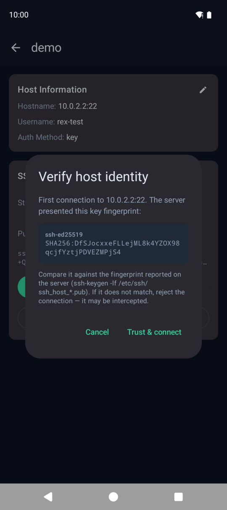
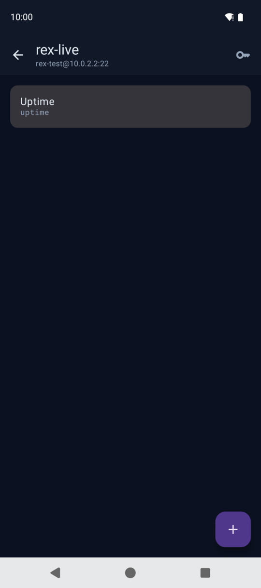
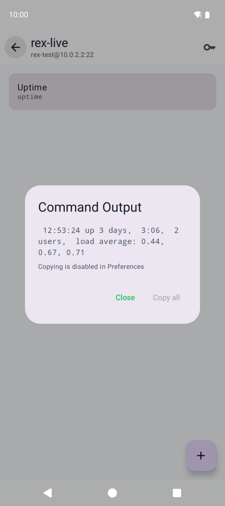

# Rex — Remote Exec for Android

Run your usual SSH commands from your phone without typing them on a phone keyboard.

Rex stores your servers and the commands you run on them. Tap a command, Rex connects over SSH, runs it, and streams the output back. SSH keys are generated on the phone, stay encrypted in Android's hardware keystore, and never leave the device.

## Install

Rex is not on the Play Store — you install the APK yourself:

1. On your phone, tap the **Download** button above (or open the [latest release](https://github.com/b3p3k0/rex/releases/latest)). Scroll to **Assets** and tap `rex-<version>.apk`.
2. Open the downloaded file. Android will ask you to allow installs from your browser — allow it once (Settings → Install unknown apps).
3. If Play Protect warns about an unknown app, choose **Install anyway**. Rex is open source — every line of it is [here](https://github.com/b3p3k0/rex).

Needs Android 8.0 or newer.

## Getting started

### 1. Add a host

Tap **+** on the home screen and enter a nickname, the hostname or IP, and the username you log in with.

### 2. Set up the SSH key

Open the host's key management screen (long-press the host → **Manage keys**) and tap **Generate Key**. Rex creates an Ed25519 key pair on the device.

Then tap **Deploy Key** and enter the account's SSH password — Rex uses it once to install the public key on the server (`~/.ssh/authorized_keys`). After that, every connection uses the key; the password is never stored.

### 3. Verify the server's fingerprint

The first time Rex connects to a new server it shows the server's key fingerprint and asks you to confirm it. Compare it with what the server reports (`ssh-keygen -lf /etc/ssh/ssh_host_ed25519_key.pub`) — if it matches, tap **Trust & connect**. Rex pins the fingerprint and will refuse to connect if it ever changes.

### 4. Add a command

Tap **Add command** on the host, give it a name, and enter the command line to run.

### 5. Run it

Tap the command. Rex connects, runs it, and shows the output when it finishes.

### Logs

Every run is recorded — host, command name, duration, exit code — under **⋮ → Logs**, with filters and search. Command *output* is never written to logs.

## Security

Private keys are generated on-device and encrypted by the Android Keystore; they cannot be exported. Unlocking key operations requires your device PIN or biometric. Server fingerprints are pinned on first use and checked on every connection. Logs store metadata only, screenshots are blocked by default, and clipboard copies auto-clear after 60 seconds. Details and vulnerability reporting: [SECURITY.md](SECURITY.md).

## For developers

Build instructions, architecture, and the full security model live in [docs/TECHNICAL_REFERENCE.md](docs/TECHNICAL_REFERENCE.md).

## License

[GPL-3.0-only](LICENSE)
